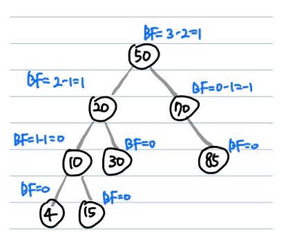

### Abstract
- 스스로 균형을 잡는 이진탐색트리
- 트리의 높이가 h이고 불균등상태(편향이진트리)라면 이진탐색트리의 시간복잡도는 O(h)
- 이를 방지하고자 높이 균형을 유지하는 트리가 AVL 트리

특징

- 이진탐색트리의 속성을 가짐
- 왼쪽, 오른쪽 서브트리의 높이 차는 최대 h
- 어떤 시점에서든지, 두 서브트리의 높이차이가 2이상이되면 회전을 통해 균형을 맞춤
- AVL트리는 높이를 logN으로 유지하기 때문에 삽입, 삭제, 검색의 시간복잡도는 O(logN)

### Balance Factor(BF)

- 왼쪽 서브트리의 높이에서 오른쪽 서브트리의 높이를 뺸 값
    - Balance Factor(k) = height(left(k)) = height(right(l))
  
1. BF = 1 : 왼쪽 서브트리의 높이가 오른쪽 서브트리의 높이보다 한 단계 높음
2. BF = 0 : 왼쪽 서브트리의 높이와 오른쪽 서브트리의 높이가 동일
3. BF = -1 : 왼쪽 서브트리의 높이가 오른쪽 서브트리의 높이보다 한 단계 낮음 서브트리의 높이보다 한 단계 낮음

### 시간복잡도

트리의 높이를 항상 logN(N은 노드의 개수)으로 유지하기 때문에, 삽입, 삭제, 검색의 시간복잡도는 O(logN)

### 회전(Rotation) 연산

- AVL 트리는 이진탐색트리의 일종이기 때문에 모든 작업은 이진탐색트리의 방식과 동일
- 삽입/삭제를 하여 |BF| >= 2 (불균등상태)가 된다면 불균형 노드를 기준으로 서브트리의 위치를 변경하는 Rotation 작업을 수행하여 균형을 맞춤
Rotation은 LL, RR, LR, RL 4가지 case로 나뉨

https://nooblette.tistory.com/m/315